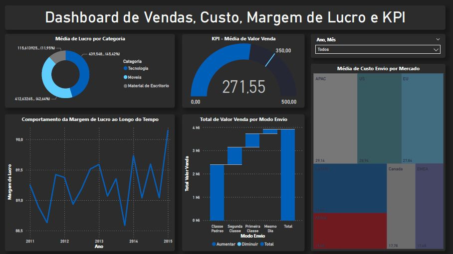

# 📊 Dashboard de Vendas, Custo, Margem de Lucro e KPI

<div align="center">

</div>

## Objetivo
Este dashboard foi desenvolvido para fornecer insights sobre os dados de vendas, custo, margem de lucro e KPI da empresa. Ele permite responder às seguintes perguntas:

- Qual foi o total de valor venda considerando cada modo de envio dos pedidos?

- Quais mercados tiveram o maior custo médio de envio dos produtos vendidos?

- A empresa tem como objetivo (meta) manter uma média de 350 para o valor de venda todos os meses. Mostrar um indicador (KPI–Key Performance Indicator) com o valor médio de venda. A empresa ficou abaixo ou acima da meta no mês de Abril/2014?

- Considere que o lucro é equivalente a:valor venda -custo envio. Qual categoria de produto apresentou maior lucro médio.

- Qual foi o comportamento da margem de lucro ao longo do tempo? Considerando a margem de lucro como o lucro dividido pelo valor venda.


## Funcionalidades do Dashboard
O dashboard oferece as seguintes funcionalidades:

- Filtro por Ano e Mês.

## Tecnologias Utilizadas
- **Power BI**: Versão Desktop PT-BR
- **Banco de Dados**: Arquivo .csv

## Instalação e Uso
1. Clone o repositório:
   ```bash
   git clone https://github.com/JessicaArauj/DashBoards_Power_BI/tree/main/Vendas%2C%20Custo%2C%20Margem%20de%20Lucro%20e%20KPI
